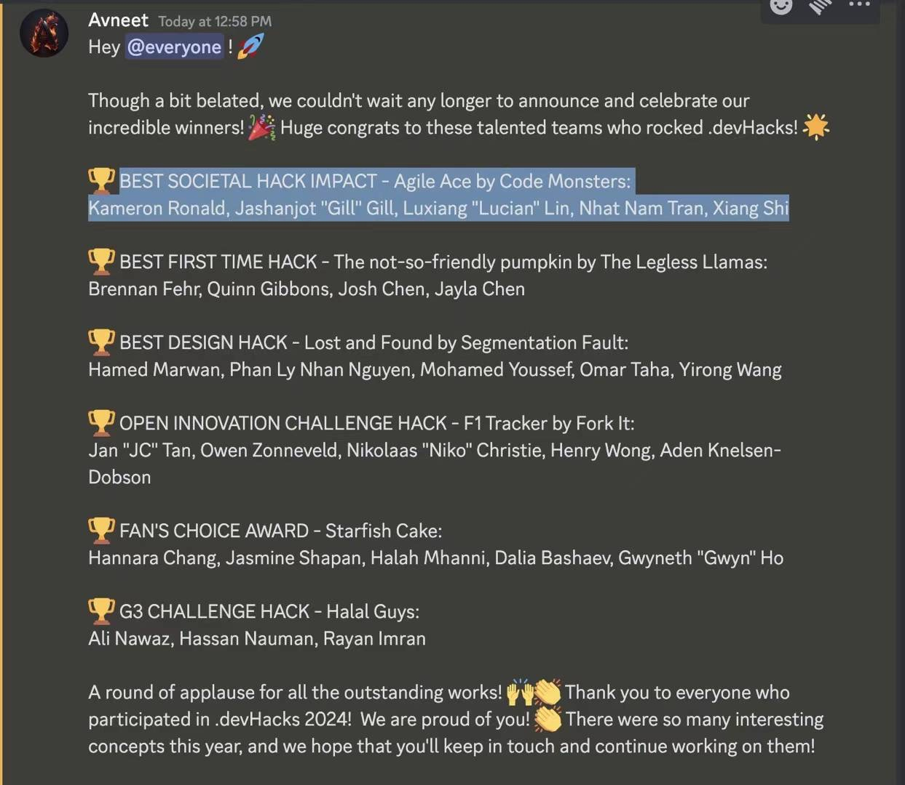

<strong>Xiang Shi</strong>

Address: Winnipeg, Waverley st. | Phone: 431-996-7839 | Email: xiangshi6622@gmail.com

 
<strong>EDUCATION</strong>

***

University of Manitoba  
Bachelor of Science, Computer Science Year 4
- GPA: 3.7 / 4.5  
- Coursework : development of Java, C, C++, LC3 simulator, Python, Android studio, SQLite Database. 

 

<strong>TECHNICAL SKILLS</strong>
***
- Functional : Database Management, Back-end develop, Front-end develop
- Language and Tools: Java, SQLite, C, C++, JavaScript, React, HTML5, Android Studio, Python

 

<strong>PROJECT EXPERIENCE</strong>
***

<strong>1. AGILE-ACE  https://agile-ace.com/ </strong>

Code Competition hosted by U of M 

Role: Project Developer and Team member

Duration: [2024-02-12] – [2024-02-15]

Tech Stack:
- Front end [React]
- Back-end [Python]
- Service [AWS cloud service]
- Database [SQL script]

Key Contributions: 
- Participated in the design and development of a 
website aimed at enhancing team efficiency by 
optimizing task planning and time allocation for 
better project management.
- Successfully implemented a user-friendly 
interface that allows team members to easily 
negotiate and establish the required time for 
tasks, using collaborative tools and technical 
strategies.
- Employes Agile development methodologies 
and best practices to ensure project delivery on 
schedule, meeting all predetermined quality 
standards.

Achievements:
“Best Societal Hack Impact” – Agile Ace by Code 
Monsters

 
 

<strong>2. ANDROID APPLICATION FOR LIBRARY SYSTEM </strong>  
https://alexandria-library.netlify.app/

Comp 3350 term project

Role: Full Stack Developer, Product Manager, UI designer, 
Structure designer, Program testing

Tech Stack: Database [HSQLDB -local database], back-end [Java]

Key Contributions:
- Our idea for this project is to build a user-friendly and 
efficient book planner system to help readers organize their 
reading plan.
- All System is suitable for tablet user and android system 
phone

 
 

<strong> 3. MUSIC LIBRARY WEB APPLICATION</strong>

Comp 3020 Project

Role: Web Development

Tech Stack: Front end [React]

Key Contributions:
- Led the project design phase, focusing on 
creating a comprehensive and user-friendly music 
library web application tailored for effective user 
engagement and content management.
- Conducted human interaction tests and design 
iterations to ensure the application was intuitive 
and accessible, significantly improving user 
experience.
- Developed the front-end and back-end 
components of the web application, 
demonstrating strong proficiency in web 
development languages and frameworks.
- Performed extensive web testing to identify and 
rectify any issues, ensuring a seamless and 
efficient user experience, while maintaining high 
standards of web performance and securit

